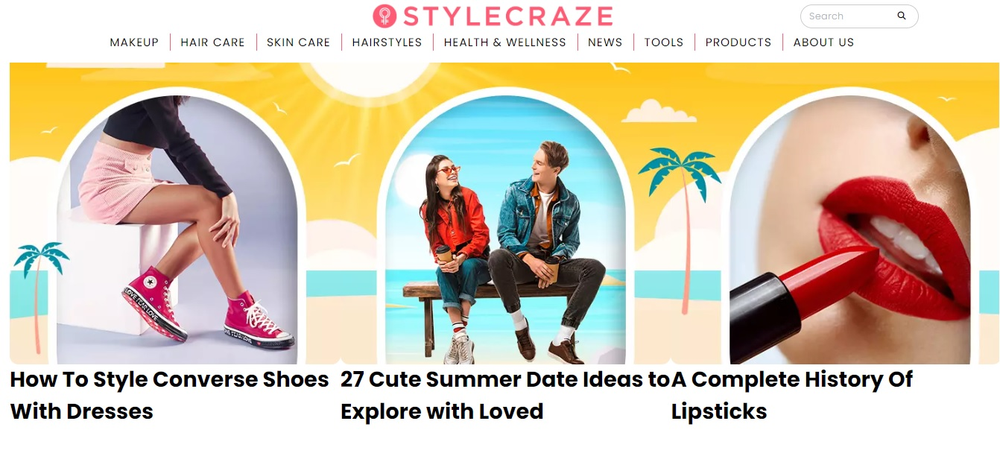
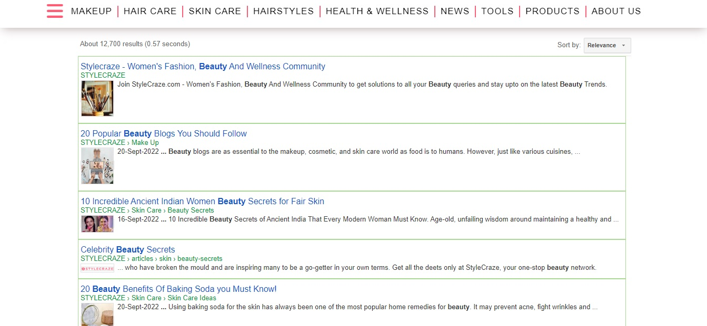

# STYLECRAZE Clone Front-End Project
---

# Welcome 👋

---

## About this project: 🙌
> This is a team project, built in the Construct Week - Unit 3 at Masai School.

---
## Our Team Members ❤️

- **[Ninad Joshi](https://github.com/Ninadjoshi212)**
- **[Ashish Monga](https://github.com/Ashishmonga00)**
- **[Mehak Kumari](https://github.com/Mehakkumari)**
- **[Chandra Dhaker](https://github.com/ChanduDhakad/)**
- **[Shaik Mohiddin](https://github.com/gouseimmu)**

---
### Demo Link 👇
**[STYLECRAZE.COM](https://incomparable-sprinkles-9ad5c0.netlify.app/)**

### Pages & Features 👇
 
- `NavBar`:Homepage Navbar consist of Categories dropdown, Search functionality and Inner Navbar with Hamburger Menu.
- `Home Page`: Overview of Articles of different caegories.
 

 

- `Search Page` : Articles search within website as well as using google search api.

 

 

- `Sign-Up`: User sign up to be done by local storage.
- `Sign-In`: User authentication to check whether user data match with existing data or not.
- `Articles Page`: Articles page created using json server and can filter according to categories.
- `Products Page` : Beauty products using API and can fliter as per type or brand.
- `Product details Page` : Details of particlar product.

---
### Tech Stack Used 🔧
- `HTML`
- `CSS`
- `JavaScript`
- `JSON SERVER`
- `API of beauty products`

---
